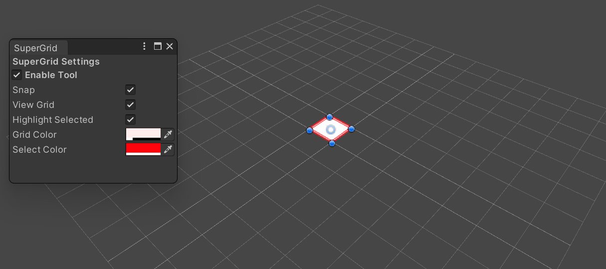

# SuperGrid!

I wrote this add-on for Unity because I like to see the grid I'm working on and I'm tired of pressing CTRL. 
To use it open the Editor Window located at **Tools/SuperGrid**.

# Screenshot

 